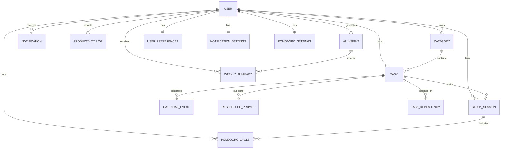

# Final Project – Web Application Development and Security 

**Course Code:** COMP6703001 
**Course Name:** Web Application Development and Security 
**Institution:** BINUS University International

## 1. Project Information
**Project Title:** 
Workload Reminder
**Project Domain:** 
Study Planner & Productivity Tracker
**Class:** 
L4BC
**Group Members:**
| Name | Student ID| Role | GitHub Username|
| ------------- | ------ | ------------- | ------ |
| HANINA ELIAS ABDOSH| 2802516030 | Analytics Page | haninaabdosh
| PATRICK WILLIAM PRABOWO| 2802554520 | Notifications, Pomodoro | MrTruck
| IMANUEL SHEVA G SIMANJUNTAK| 2802499592 | Login, Dashboard | Sheva123456

## 2. Instructor and Repository 
**Instructor:** Ida Bagus Kerthyayana Manuaba 
- Email: imanuaba@binus.edu 
- GitHub: bagzcode 

**Instructor Assistant:** Juwono 
- Email: juwono@binus.edu 
- GitHub: Juwono136

[GitHub Repository link](https://github.com/MrTruck/WADS-FinalProject-Group-1)

## 3. Project Overview
### 3.1 Problem Statement
With the increasing demand for productivity, emerges a need for students to keep tract and plan ahead of assignments and projects. These days, schools and similar institutions have started to increasingly shifted away from traditional paper examinations and began to use projects and assignments as a means to asses students understanding of a subject. These projects and assignments take a long period of time to finish and require rigorous planning and time management for successful executions. Additionally some schools implement both projects and examinations for assessments. Thus students need a tool to manage their time and workload to prevent burnout and missed deadlines. A tool like this will not only solve these new problems, it could also manage traditional school works such as assignments, quizzes, activities etc.

Existing tools are often de-centralised and dont integrate crucial features seamlessly, thus making students feel fragmented in their workflow. As their workloads increase, the lack of an integrated planning and productivity system negatively impacts performance, increases stress, and reduces learning ability.

#### Target Audience:
- University students  
- High school students
- Online course participants
- Any working individual

### 3.2 Solution Overview

#### Core features include:

1. **Task & Deadline Management:**
Create, edit, and delete assignments
Set deadlines and priorities
Track completion status

2. **Calendar Integration**
Visual monthly/weekly planner
Deadline overlays
Study session scheduling

3. **Study Session Timers**
Pomodoro or custom timers
Session start/stop tracking
Logged study durations

4. **Progress Analytics Dashboard**
Productivity charts
Study time trends
Completion rates

5. **Notifications & Reminders**
Deadline alerts
Study session reminders
Smart rescheduling prompts

#### Why this solution is appropriate:

This solution is appropriate because it directly addresses some of the root causes of academic disorganization:

- Centralization
Combines tasks, calendars, and timers into one platform

- Automation
Reduces reliance on memory through reminders

- Visualization
Calendar and dashboards improve planning clarity

- Data-driven insights
Analytics help students adjust study habits

- Accessibility
Web-based system accessible across devices

Which when compared to generic to-do apps, this system is academically specialized, supporting structured study workflows rather than simple task lists.

#### Where AI is used

Artificial Intelligence enhances the planner by adding intelligent automation and personalization.

1. **Smart Task Prioritization**
Determining the urgency of a given task based on the amount of tasks at hand, difficulty, and deadline.

2. **AI-Based Burnout Detection**
The burnout detection module focuses on student well-being by identifying unhealthy study patterns and cognitive overload risks. Without any intervention, burnout can reduce academic performance and harm mental health.
**Data Monitored:**
*- Study Activity:* daily study duration, number of sessions per day, consecutive study days
*- Break Patterns:* break frequency, session spacing
*- Productivity Trends:* task completion rates, focus timer interruptions, declining performance analytics

## 4. Technology Stack 


| Layer| Technology|
|------|------------|
| Frontend         | Next.js  |
| Backend          | Node.js or Next.js |
| API              | REST API|
| Database         | PostgreSQL |
| Containerization | Docker |
| Deployment       | Cloudflare |
| Version Control  | GitHub |

## 5. System Architecture
### 5.1 Architecture Diagram 
#### Monolithic architecture

                   +-------------------------+
                   |      Browser Client     |
                   |  (Next.js app pages &   |
                   |   React client logic)   |
                   +-----------+-------------+
                               |
                               | HTTP requests / fetch()
                               | cookies + CSRF header
                               v
                   +-----------+-------------+
                   |      Next.js Server      |
                   |  (app router + API routes)|
                   +-----------+-------------+
                               |
                 +-------------+--------------+
                 |    middleware.ts layer     |
                 |  - security headers         |
                 |  - JWT auth enforcement     |
                 |  - CSRF validation          |
                 |  - admin route checks       |
                 +-------------+--------------+
                               |
                               v
                   +-----------+-------------+
                   |      API Route Layer     |
                   |  /app/api/auth/*         |
                   |  /app/api/v1/*           |
                   |  /app/api/ai/*           |
                   +-----------+-------------+
                               |
                 +-------------+--------------+
                 |      Shared server libs     |
                 |  - auth.ts                 |
                 |  - csrf.ts                 |
                 |  - validators.ts           |
                 |  - rateLimit.ts            |
                 |  - response.ts             |
                 +-------------+--------------+
                               |
                               v
                   +-----------+-------------+
                   |     Prisma Client        |
                   |     (lib/prisma.ts)      |
                   +-----------+-------------+
                               |
                               v
                   +-----------+-------------+
                   |    PostgreSQL Database   |
                   |   (prisma/schema.prisma) |
                   +-------------------------+
                   
### 5.2 Architecture Explanation
### Frontend ↔ API ↔ Database Interaction

- The project is a single **Next.js fullstack application**.
- Frontend UI is built with **Next.js App Router** and **React client components** under `app` and `components`.
- The browser sends requests to server-side API endpoints under `api`.
- API handlers use **Prisma** via `prisma.ts` to communicate with a **PostgreSQL** database defined in `schema.prisma`.

### Example Flow

1. User interacts with a page such as `page.tsx`.
2. The page calls API routes like:
   - `/api/v1/tasks`
   - `/api/auth/login`
   - `/api/ai/burnout`
3. The Next.js server processes the request through `middleware.ts`.
4. The API route uses shared libraries (`auth.ts`, `csrf.ts`, `validators.ts`, `rateLimit.ts`, `response.ts`) for business logic.
5. The API route queries or updates the database through Prisma.
6. The backend returns JSON to the frontend, which updates the UI.

### Separation of Concerns

### `app`

- Contains the frontend pages, client components, and the API route structure.
- Client code handles rendering, event handling, and calling API endpoints.

### `api`

- Implements backend route handlers for:
  - Authentication
  - Tasks
  - Pomodoro
  - Analytics
  - AI
  - etc.
- Each API route is responsible for one server-side operation.

### `lib`

Contains reusable server-side utilities:

- `auth.ts`
  - JWT generation and verification
  - Password hashing
  - Cookie management

- `csrf.ts`
  - CSRF token generation and validation

- `validators.ts`
  - Input validation schemas

- `rateLimit.ts`
  - Rate limiting logic for sensitive endpoints

- `response.ts`
  - Standardized API response helpers

### `prisma`

- Defines the database schema and models.
- `prisma.ts` exposes a shared Prisma client to the API.

### `middleware.ts`

- Acts as a cross-cutting layer for request-level security and authorization.

### `__tests__`

- Contains test coverage for pages and security behavior.

### Where Security Is Enforced

### `middleware.ts`

- Adds security HTTP headers:
  - `X-Content-Type-Options`
  - `X-Frame-Options`
  - `X-XSS-Protection`
  - `Referrer-Policy`
  - `Permissions-Policy`
- Requires authentication for `/api/*` routes except public auth endpoints.
- Verifies the presence and format of the access JWT cookie (`wr_access`).
- Blocks invalid tokens with `401 Unauthorized`.
- Protects admin routes under `/api/v1/admin` by checking the decoded JWT role.
- Enforces CSRF protection for mutating HTTP methods (`POST`, `PUT`, `PATCH`, `DELETE`) by requiring `x-csrf-token`.

### `auth.ts`

- Generates `wr_access` and `wr_refresh` JWT cookies.
- Uses:
  - `httpOnly`
  - `secure` (in production)
  - `sameSite: "strict"`
  for authentication cookies.
- Verifies access and refresh tokens on requests.
- Hashes passwords with `bcrypt` for registration and login.

### `route.ts` (Login)

- Validates login input.
- Applies rate limiting to prevent brute-force attacks.
- Sets secure cookies and issues a CSRF token cookie.

### `route.ts` (Registration)

- Validates registration input and sanitizes values.
- Prevents duplicate accounts and returns safe responses.

### CSRF Protection

- The frontend reads the `csrf-token` cookie and sends it in the `x-csrf-token` header for mutating requests.
- `middleware.ts` rejects requests with missing CSRF tokens.
- `csrf.ts` validates token freshness and integrity.

### `rateLimit.ts`

- Adds throttling for authentication endpoints such as:
  - Login
  - Registration


        
## 6. API Design 

### 6.1 API Endpoints

| Method | Endpoint                                 | Description                                   | Auth Required |
| ------ | ---------------------------------------- | --------------------------------------------- | ------------- |
| POST   | `/auth/register`                         | Register a new user account                   | No            |
| POST   | `/auth/login`                            | Login and receive an authenticated session    | No            |
| GET    | `/auth/me`                               | Retrieve the currently authenticated user     | Yes           |
| GET    | `/tasks`                                 | Retrieve all tasks for the authenticated user | Yes           |
| POST   | `/tasks`                                 | Create a new task                             | Yes           |
| GET    | `/tasks/{taskId}`                        | Retrieve a specific task by ID                | Yes           |
| PUT    | `/tasks/{taskId}`                        | Update an existing task                       | Yes           |
| DELETE | `/tasks/{taskId}`                        | Delete a task                                 | Yes           |
| GET    | `/categories`                            | Retrieve all task categories                  | Yes           |
| POST   | `/categories`                            | Create a new category                         | Yes           |
| PUT    | `/categories/{categoryId}`               | Update an existing category                   | Yes           |
| DELETE | `/categories/{categoryId}`               | Delete a category                             | Yes           |
| GET    | `/sessions`                              | Retrieve all study sessions                   | Yes           |
| POST   | `/sessions`                              | Start a new study session                     | Yes           |
| GET    | `/pomodoro/settings`                     | Retrieve Pomodoro settings                    | Yes           |
| PUT    | `/pomodoro/settings`                     | Update Pomodoro settings                      | Yes           |
| POST   | `/pomodoro/cycle`                        | Log a completed Pomodoro cycle                | Yes           |
| GET    | `/pomodoro/cycles`                       | Retrieve all logged Pomodoro cycles           | Yes           |
| GET    | `/notifications`                         | Retrieve all notifications                    | Yes           |
| PATCH  | `/notifications/{notificationId}/read`   | Mark a notification as read                   | Yes           |
| GET    | `/notifications/settings`                | Retrieve notification preferences             | Yes           |
| PUT    | `/notifications/settings`                | Update notification preferences               | Yes           |
| GET    | `/analytics/progress`                    | Retrieve user progress statistics             | Yes           |
| GET    | `/analytics/productivity`                | Retrieve productivity trends                  | Yes           |
| GET    | `/analytics/workload`                    | Retrieve workload density analysis            | Yes           |
| GET    | `/analytics/completion`                  | Retrieve completion rate statistics           | Yes           |
| GET    | `/analytics/streak`                      | Retrieve current study streak                 | Yes           |
| GET    | `/ai/insights`                           | Retrieve AI-generated productivity insights   | Yes           |
| GET    | `/ai/suggestions`                        | Retrieve AI-generated task suggestions        | Yes           |
| POST   | `/ai/suggestions/{suggestionId}/accept`  | Accept an AI suggestion                       | Yes           |
| POST   | `/ai/suggestions/{suggestionId}/dismiss` | Dismiss an AI suggestion                      | Yes           |


---

### 6.2 API Documentation

#### Swagger Documentation


* ** Swagger URL:** `https://e2526-wads-b4bc-07.csbihub.id/api-doc`
* **Documentation Format:** OpenAPI / Swagger UI


### Example API Request

#### User Login

**Endpoint**

```http
POST /auth/login
```

**Request Body**

```json
{
  "email": "user@example.com",
  "password": "password123"
}
```

**Example Success Response (200 OK)**

```json
{
  "success": true,
  "message": "Login successful",
  "token": "your-jwt-or-session-token",
  "user": {
    "id": 1,
    "name": "John Doe",
    "email": "user@example.com"
  }
}
```

---

### Example API Request

#### Create Task

**Endpoint**

```http
POST /tasks
```

**Request Body**

```json
{
  "title": "Complete Database Assignment",
  "description": "Finish ERD and SQL implementation",
  "priority": "HIGH",
  "difficulty": "MEDIUM"
}
```

**Example Success Response (201 Created)**

```json
{
  "id": 15,
  "title": "Complete Database Assignment",
  "description": "Finish ERD and SQL implementation",
  "priority": "HIGH",
  "difficulty": "MEDIUM",
  "status": "PENDING",
  "createdAt": "2026-06-15T10:30:00Z"
}
```

---

### Authentication

Protected endpoints require authentication.

* Public Endpoints:

  * `POST /auth/register`
  * `POST /auth/login`

* Authenticated Endpoints:

  * `/tasks/*`
  * `/categories/*`
  * `/sessions/*`
  * `/pomodoro/*`
  * `/notifications/*`
  * `/analytics/*`
  * `/ai/*`


---

### Technologies Used

* REST API Architecture
* OpenAPI (Swagger) Documentation
* JSON Request/Response Format
* HTTP Status Codes
* Authentication & Authorization
* CRUD Operations
* AI-powered Recommendation Endpoints
* Analytics & Progress Tracking APIs

## 7. Database Design
### 7.1 Database Choice
Chosen Database: PostgreSQL
The project is already configured to use PostgreSQL via schema.prisma:
provider = "postgresql"
url = env("DATABASE_URL")

#### Why PostgreSQL?
PostgreSQL is a strong fit for this app because the data model is inherently relational:
* users have many tasks, notifications, sessions, and related settings
* tasks belong to categories and can have dependency links
* study sessions, pomodoro cycles, and analytics records all require consistent references

PostgreSQL provides:
* ACID transactions for safe registration, scheduling, and analytics updates
* foreign keys and cascading deletes for referential integrity
* powerful query capabilities for reporting, filtering, and aggregation

In addition, Prisma works naturally with PostgreSQL and makes schema-driven development easier.

### 7.2 Schema / Data Structure
#### ERD


## 8. AI Features
### AI Feature List

| Feature | Purpose | AI Type | Implementation / Notes |
|----------|---------|---------|------------------------|
| **Burnout Detector** | Analyze a user's study and task analytics to estimate burnout risk, then generate a risk score, risk level, reasons, and recommendations. | Recommendation / Prediction | Implemented in `route.ts` + `burnout.ts`. The system sends analytics to the AI model and receives a JSON payload containing `burnoutRiskScore`, `riskLevel`, `reasons`, and `recommendations`. The output is saved as an AI insight in the database and displayed on the dashboard and analytics pages. If the AI service fails, a fallback scoring function still returns a burnout estimate. |
| **Task Prioritization** | Analyze upcoming tasks and compute urgency rankings so tasks can be assigned updated priorities. | Recommendation / Decision Support | Implemented in `route.ts` + `prioritization.ts`. The AI receives task metadata including due date/minutes until due, difficulty, estimated hours, and current status. The model returns a score and short reason for each task. The route converts these scores into priority labels (`URGENT`, `HIGH`, `MEDIUM`, `LOW`) and updates the tasks in the database. |


### 8.2 AI Integration Flow

* User actions, such as creating or updating tasks, trigger the collection of analytics through `fetchUserAnalytics(...)`, which gathers information including upcoming tasks, overdue task counts, session and focus metrics, study minutes, and study streaks. For burnout detection, `route.ts` calls `detectBurnout(analytics)`, while `burnout.ts` sends the collected analytics as JSON to `callLLM(...)` for analysis. The AI model evaluates the user's workload and returns a burnout risk score, risk level, reasons, and recommendations. For task prioritization, `route.ts` calls `prioritizeTasks(analytics)`, and `prioritization.ts` constructs a task feature list containing information such as due dates, difficulty, estimated hours, and task status before sending it to `callLLM(...)`. The AI model then generates a ranked score for each task based on its urgency.

* The AI-generated results are integrated directly into the system to improve user productivity. Burnout detection returns a `burnoutRiskScore`, `riskLevel`, `reasons`, `recommendations`, and `generatedAt` timestamp, which are displayed on the dashboard and analytics pages and stored in the `ai_insight` table for future reference. If a high burnout risk is detected, the system can automatically generate a `BURNOUT_ALERT` notification. Similarly, task prioritization returns the updated task rankings and assigned priority levels, allowing the system to update the task priority fields in the database so users see their tasks reordered with urgency labels and receive AI-guided recommendations on what to focus on next.

## 9. Security Implementation
### Authentication
    
* Uses JWT-based authentication, not server sessions.
* auth.ts issues:     
    -   access tokens via generateAccessToken(payload)
    -   refresh tokens via generateRefreshToken(payload)  
* Tokens are stored in cookies:
    -   wr\_access = access token
    -   wr\_refresh = refresh token  
* setAuthCookies() marks tokens as:
    -   httpOnly: true      
    -   secure: process.env.NODE\_ENV === 'production' 
    -   sameSite: 'strict'    
* Login route validates credentials with bcrypt and then issues both tokens plus a CSRF token.    
* Refresh endpoint validates the refresh JWT and re-issues new tokens.
        
    
### Authorization
    
*   Role is stored in JWT payload as role.
*   middleware.ts checks JWT presence on API routes and enforces admin-only access for /api/v1/admin/\*.
*   If a request lacks auth or an admin route is accessed without role === 'ADMIN', it returns 401/403.
        
    
### Input Validation
    
*   Uses Zod schemas in validators.ts for request validation.
*   Examples:
    -   registerSchema     
    -   loginSchema    
    -   createTaskSchema   
    -   createSessionSchema  
    -   sendNotificationSchema
*   Handlers call safeParse(body) and reject invalid payloads with 400 Bad Request.
        
    
### Protection Against Injection
    
*   SQL/ORM injection:
        
    
    -   Uses Prisma ORM for database access, which parameterizes queries rather than building raw SQL strings. 
    -   Route handlers pass validated data to Prisma methods like findUnique, create, and findMany.
    
*   NoSQL injection:
        
    
    -   Not directly applicable here because the backend uses Prisma/SQL-style DB access, but the same validation and ORM parameterization protect query inputs.
        
    
### Protection Against XSS
    
* sanitize.ts provides:  
    -   sanitizeString() escaping & < > " ' /
    -   sanitizeObject() recursively sanitizing nested arrays/objects
*   Registration flow sanitizes incoming user data before persisting.     
*   Tests verify dangerous strings are escaped and nested structures are sanitized.
        
    
### CSRF Protection
    
* csrf.ts generates HMAC-based tokens using:
    * CSRF\_SECRET from env
    * userId
    * timestamp
*   Mutating requests require an x-csrf-token header.
*   middleware.ts rejects state-changing API requests with missing CSRF token.
* Several route handlers also validate the CSRF token explicitly with validateCsrfToken(token, user.userId).
        
    
### Secure API Key / Secret Handling
    
* Secrets are kept in environment variables:
        
    
    -   JWT\_SECRET, JWT\_REFRESH\_SECRET
    -   CSRF\_SECRET
    -   AI\_SERVICE\_KEY, AI\_SERVICE\_URL
    -   GROQ\_API\_KEY
    -   CRON\_SECRET
        
    
* Server-only code reads these values; API keys are never exposed to client-side code.
        
* Internal endpoint route.ts requires Authorization: Bearer ${process.env.CRON\_SECRET}.
        
    
### Additional HTTP Security
    
* middleware.ts sets security headers on responses:
        
    -   X-Content-Type-Options: nosniff        
    -   X-Frame-Options: DENY        
    -   X-XSS-Protection: 1; mode=block
    -   Referrer-Policy: strict-origin-when-cross-origin
    -   Permissions-Policy: camera=(), microphone=(), geolocation=()  
    -   Strict-Transport-Security in production

## 10. Testing Documentation
### 10.1 Frontend Testing
| Test Case                                                       | Scenario                                                                   | Expected Result                                                             | Status   |
| --------------------------------------------------------------- | -------------------------------------------------------------------------- | --------------------------------------------------------------------------- | -------- |
| Renders login form and toggles to sign up                       | (UI behavior) Render login page and switch to sign up                      | Login fields render, sign up shows name field and **Create Account** button | ✅ Passed |
| Updates form inputs on change                                   | (UI behavior) Edit email and password inputs                               | Input values update correctly                                               | ✅ Passed |
| Enforces required fields in login and sign up modes             | (Form validation testing) Verify required attributes for login and sign up | Email/password are required in login; name is required in sign up           | ✅ Passed |
| Shows a network error message when login fetch fails            | (Error handling) Login fetch rejects                                       | Network failure error displayed, no redirect                                | ✅ Passed |
| Shows API error message when login fails                        | (Error handling) Login API returns failure                                 | Invalid credentials message displayed, no redirect                          | ✅ Passed |
| Redirects to dashboard on successful login                      | (UI behavior) Login API succeeds                                           | Router pushes `/dashboard`                                                  | ✅ Passed |
| Renders dashboard header and initial controls                   | (UI behavior) Render dashboard page                                        | Header, view buttons, **Upcoming Tasks** text appear                        | ✅ Passed |
| Opens new task modal when clicking New Task                     | (UI behavior) Click **New Task** button                                    | New task modal opens with title input and **Create Task** button            | ✅ Passed |
| Shows validation error when creating a new task without a title | (Form validation testing) Attempt create task with empty title             | Title required error shown                                                  | ✅ Passed |
| Displays an error banner when task creation fails               | (Error handling) Task creation API returns failure                         | Error banner shows failure message                                          | ✅ Passed |
| Closes the new task modal when the close button is clicked      | (UI behavior) Click modal close button                                     | New task modal closes                                                       | ✅ Passed |
| Changes calendar views when toggled                             | (UI behavior) Switch between weekly and daily views                        | Weekly view shows day names, daily view shows **Today**                     | ✅ Passed |
| Renders notification content and dismiss button                 | (UI behavior) Render notification popup                                    | Title, message, and **Dismiss** button appear                               | ✅ Passed |
| Calls `onDismiss` when close button clicked                     | (UI behavior) Click dismiss button                                         | `onDismiss` callback is called                                              | ✅ Passed |
| Auto-dismisses after the notification timeout                   | (UI behavior) Wait notification timer                                      | `onDismiss` callback is called after timeout                                | ✅ Passed |
| Renders the widget and timer                                    | (UI behavior) Render Pomodoro widget                                       | **Pomodoro** title and **Work** label appear                                | ✅ Passed |
| Links to the Pomodoro page                                      | (UI behavior) Check widget link                                            | Widget anchor `href` is `/pomodoro`                                         | ✅ Passed |


### 10.2 Backend & API Testing

| Test Case | Method | Endpoint | Description | Expected Result | Status |
|-----------|--------|----------|-------------|-----------------|--------|
| **Authentication** | | | | | |
| API‑01 | POST | `/api/auth/register` | Valid email, password, name | 201 Created | PASS |
| API‑02 | POST | `/api/auth/register` | Missing password field | 400 Bad Request | PASS |
| API‑03 | POST | `/api/auth/register` | Email as number (invalid type) | 400 Bad Request / validation error | PASS|
| API‑04 | POST | `/api/auth/login` | Valid credentials | 200 OK, JWT token & cookie | PASS |
| API‑05 | POST | `/api/auth/login` | Wrong password | 401 Unauthorized | PASS |
| API‑06 | POST | `/api/auth/login` | Non‑existent user | 401 Unauthorized | PASS |
| API‑07 | GET | `/api/auth/me` | No auth header/cookie | 401 Unauthorized | PASS |
| API‑08 | GET | `/api/auth/me` | Valid session cookie | 200 OK, user profile | PASS |

| **Tasks (CRUD)** | | | | | |
| API‑11 | POST | `/api/v1/tasks` | Valid title & priority (CSRF token present) | 201 Created | PASS |
| API‑12 | POST | `/api/v1/tasks` | Missing `title` field | 400 Bad Request | PASS |
| API‑13 | POST | `/api/v1/tasks` | Priority as integer (invalid type) | 400 Bad Request | PASS |
| API‑14 | GET | `/api/v1/tasks/{validId}` | Existing task ID | 200 OK, task object | PASS |
| API‑15 | GET | `/api/v1/tasks/fake-id-123` | Non‑existent ID | 404 Not Found | PASS |
| API‑16 | PUT | `/api/v1/tasks/{validId}` | Valid update (title, status) | 200 OK | PASS |
| API‑17 | PUT | `/api/v1/tasks/{validId}` | Invalid input (empty title) | 400 Bad Request | PASS |
| API‑18 | DELETE | `/api/v1/tasks/{validId}` | Existing ID (valid CSRF) | 204 No Content | PASS |
| API‑19 | DELETE | `/api/v1/tasks/non‑existent` | Non‑existent ID (valid CSRF) | 404 Not Found | PASS |
| API‑20 | GET | `/api/v1/tasks/` | List all tasks (authenticated) | 200 OK, array of tasks | PASS |
| **Categories** | | | | | |
| API‑40 | POST | `/api/v1/categories` | Valid name & color | 201 Created | PASS |
| API‑41 | POST | `/api/v1/categories` | Duplicate category name | 409 Conflict | PASS |
| API‑42 | GET | `/api/v1/categories` | Fetch all categories | 200 OK, array | PASS |
| API‑43 | PUT | `/api/v1/categories/{id}` | Update category name | 200 OK | PASS |
| API‑44 | DELETE | `/api/v1/categories/{id}` | Delete existing category | 204 No Content | PASS |
| **Study Sessions** | | | | | |
| API‑45 | POST | `/api/v1/sessions` | Valid `task_id` & `start_time` | 201 Created | PASS |
| API‑46 | POST | `/api/v1/sessions` | Invalid / truncated `task_id` | 400 Bad Request | PASS |
| API‑47 | GET | `/api/v1/sessions` | List all sessions for user | 200 OK, array | PASS |
| **Pomodoro** | | | | | |
| API‑48 | GET | `/api/v1/pomodoro/settings` | Fetch user settings | 200 OK | PASS |
| API‑49 | PUT | `/api/v1/pomodoro/settings` | Update work/break durations | 200 OK | PASS |
| API‑50 | POST | `/api/v1/pomodoro/cycle` | Log a valid Pomodoro cycle | 201 Created | PASS |
| API‑51 | GET | `/api/v1/pomodoro/cycles` | Get all logged cycles | 200 OK | PASS |
| **Notifications** | | | | | |
| API‑52 | GET | `/api/v1/notifications/settings` | Get notification preferences | 200 OK | PASS |
| API‑53 | PUT | `/api/v1/notifications/settings` | Update notification preferences | 200 OK | PASS |
| API‑54 | GET | `/api/v1/notifications` | Fetch all notifications | 200 OK | PASS |
| API‑55 | (PATCH) | (mark read) | Mark notification as read | 200 OK | NOT TESTED |
| **Analytics** | | | | | |
| API‑56 | GET | `/api/v1/analytics/progress` | Progress status | 200 OK | PASS |
| API‑57 | GET | `/api/v1/analytics/productivity?days=7` | Productivity trends | 200 OK | PASS |
| API‑58 | GET | `/api/v1/analytics/workload?days=14` | Workload density | 200 OK | PASS |
| API‑59 | GET | `/api/v1/analytics/completion?days=30` | Completion rates | 200 OK | PASS |
| API‑60 | GET | `/api/v1/analytics/streak` | Study streak | 200 OK | PASS |
| **AI Modules** (basic endpoint checks) | | | | | |
| API‑61 | GET | `/api/v1/ai/insights` | Fetch AI insights | 200 OK | PASS |
| API‑62 | GET | `/api/v1/ai/suggestions` | Fetch AI suggestions | 200 OK | PASS |
| API‑63 | (POST) | Accept an AI suggestion | – | 200 OK | NOT TESTED |
| API‑64 | (POST) | Dismiss an AI suggestion | – | 200 OK | NOT TESTED |
| **Admin** | | | | | |
| API‑65 | POST | `/api/auth/login` | Admin login (`admin@example.com`) | 200 OK, admin token | PASS |

### 10.3 Security Testing

| Test Case | Attack Type / Scenario | Expected Behaviour | Status |
|-----------|------------------------|-------------------|--------|
| SEC‑21 | Empty input fields (registration) | 400 Bad Request |PASS |
| SEC‑22 | Boundary – title exactly 255 chars | Accepted, 201 Created | PASS |
| SEC‑23 | Boundary – title > 255 chars | Rejected, 400 | PASS |
| SEC‑24 | Boundary – title 1 char (minimum) | Accepted, 201 | PASS |
| SEC‑25 | Special characters in task title | Accepted, stored safely | PASS |
| SEC‑26 | SQL Injection – email `' OR '1'='1` | Input sanitised, login fails / 400 | PASS |
| SEC‑27 | Stored XSS – name `<script>alert('XSS')</script>` | - | PASS |
| SEC‑28 | XSS in task title  | - | PASS |
| SEC‑29 | Invalid email format (`notanemail`) | 400 Bad Request | PASS |
| SEC‑30 | Invalid `estimated_hours` (negative number) | 400 Bad Request | PASS |
| SEC‑31 | Duplicate email registration | 409 Conflict | PASS |
| SEC‑32 | CSRF – POST task without `x-csrf-token` header | 403 Forbidden | PASS |
| SEC‑33 | Expired token access | 401 Unauthorized | PASS |
| SEC‑34 | Logout – subsequent request with old token | 401 Unauthorized (token invalidated) | PASS |
| SEC‑35 | Session timeout (cleared cookie) | 401 Unauthorized | PASS |
| SEC‑36 | Correct HTTP status – invalid endpoint | 404 Not Found | PASS |
| SEC‑37 | Incorrect HTTP method – DELETE on `/api/v1/tasks` collection | 405 Method Not Allowed | PASS |
| SEC‑38 | Concurrent requests (10 rapid GETs) | No crashes, consistent 200 responses | PASS |
| SEC‑39 | Password change (placeholder) | Secure flow, old token invalidated | NOT TESTED |

### 10.4 AI Functionality Testing
# AI Features – Burnout & Prioritize

| Test Case | Input | Expected Output | Actual Output | Status |
|-----------|-------|-----------------|---------------|--------|
| AI‑01 | `{}` | `200 OK`, `burnoutRiskScore` (number), `riskLevel`, `reasons`, `recommendations`, `generatedAt` | `200 OK`, data returned | PASS |
| AI‑02 | `{"days_back": 14}` | `200 OK`, analysis based on 14 days | `200 OK`, analysis returned | PASS |
| AI‑03 | (no `x-user-id` header) | `401 Unauthorized`, `{"error":"Missing user id"}` | `401 Unauthorized` | PASS |
| AI‑04 | `{"days_back": "abc"}` | `400 Bad Request` or `500` (validation/parse error) | `500` with error details | PASS |
| AI‑05 | AI unavailable (`GROQ_API_KEY` removed) | `500` with error message | `500` with error | PASS |
| AI‑06 | Consistency: 3 identical requests | Similar `burnoutRiskScore` and `riskLevel` across runs | Scores consistent (±5), risk level same | PASS |
| AI‑07 | (valid `x-user-id`) | `200 OK`, latest saved insight | `200 OK`, returned saved data | PASS |
| AI‑08 | (no `x-user-id` header) | `401 Unauthorized` | `401 Unauthorized` | PASS |
| AI‑09 | New user (no saved insight) | `200 OK`, `null` | `200 OK`, `null` | PASS |
| AI‑10 | `{}` (valid user with tasks) | `200 OK`, `success: true`, `tasks`, `rankings` | `200 OK`, data returned | PASS |
| AI‑11 | (no `x-user-id` header) | `401 Unauthorized` | `401 Unauthorized` | PASS |
| AI‑12 | User with no tasks | `200 OK`, empty `tasks` and `rankings` | `200 OK`, empty arrays | PASS |
| AI‑13 | 31 requests (rate limit) | `429 Too Many Requests` on 31st | `429` after 30 successful | PASS |
| AI‑14 | AI unavailable (`GROQ_API_KEY` removed) | `500` or `429` with error | `500` with error message | PASS |

## Failure Handling

## 11. Deployment & Production Setup 
### 11.1 Docker Setup 
• Dockerfile included - yes
• docker-compose.yml included - yes

### 11.2 Production Environment 

#### Environment Variables

Environment variables are used to store configuration values needed by the application.

The production environment uses:

* `JWT_SECRET`: signs access tokens
* `JWT_REFRESH_SECRET`: signs refresh tokens
* `JWT_EXPIRES_IN`: sets the access token lifetime
* `JWT_REFRESH_EXPIRES_IN`: sets the refresh token lifetime
* `CSRF_SECRET`: supports CSRF protection
* `CRON_SECRET`: protects scheduled server operations
* `NODE_ENV`: enables production mode
* `GROQ_API_KEY`: connects the application to Groq AI
* `DATABASE_URL`: connects Prisma to the production database

Docker Compose loads the production environment file into the container:

```yaml
env_file:
  - .env.production
```

#### Secrets Handling

Sensitive values are stored in GitHub repository secrets instead of being written directly in the source code.

The secrets are stored under:

```text
Repository Settings
-> Secrets and variables
-> Actions
```

Examples include:

```text
JWT_SECRET
JWT_REFRESH_SECRET
CSRF_SECRET
CRON_SECRET
GROQ_API_KEY
DATABASE_URL
DOCKER_USERNAME
DOCKER_PASSWORD
```

The GitHub Actions workflow reads the secrets during deployment:

```yaml
JWT_SECRET=${{ secrets.JWT_SECRET }}
DATABASE_URL=${{ secrets.DATABASE_URL }}
GROQ_API_KEY=${{ secrets.GROQ_API_KEY }}
```

The workflow creates `.env.production` on the remote server. The actual secret values are not committed to GitHub.

Environment files are ignored using `.gitignore`:

```gitignore
.env
.env.*
!.env.example
```

#### HTTPS Configuration


The production website uses HTTPS:

https://e2526-wads-b4bc-07.csbihub.id

HTTPS is handled by Cloudflare. Cloudflare provides the SSL certificate and forwards requests to the Next.js application running inside Docker.

Docker forwards server port 3028 to port 3000 inside the container:

ports:
  - "3028:3000"

The request flow is:

1. Browser
2. HTTPS through Cloudflare
3. Remote server port 3028
4. Docker container port 3000
5. Next.js application


The middleware also adds security headers, including Strict-Transport-Security, to encourage browsers to keep using HTTPS.

Authentication cookies such as wr_access and wr_refresh are marked as Secure and HttpOnly, so they are only sent over HTTPS and cannot be accessed by client-side JavaScript.

### 11.3 Live Application URL 
https://e2526-wads-b4bc-07.csbihub.id

## 12. GitHub Contribution Summary (INDIVIDUAL) 

### 12.1 Student Name: Hanina Elias Abdosh
**Features implemented:**

- Built authentication system (JWT, refresh tokens, HttpOnly cookies) and session management
- Designed and implemented CSRF protection for all state-changing endpoints
- Created Zod validation schemas for all request bodies
- Built API response formatter for consistent success/error output
- Prisma client and Swagger documentation integration
- Used Neon for database hosting and Prisma ORM for schema design and migrations
- Implemented core REST API endpoints such as auth, tasks, categories, sessions, pomodoro cycles, notifications, analytics, admin
- Created initial health check endpoint for deployment
- Swagger JSDoc annotations to route files
- Basic login and registration page integration with backend authentication APIs. Also worked on the analytics page

**API endpoints handled:**
- `app/api/auth/me/route.ts`
- `app/api/v1/tasks/[id]/complete/route.ts`
- `app/api/v1/sessions/route.ts` (GET)
- `app/api/v1/pomodoro/cycles/route.ts`
- `app/api/v1/notifications/[id]/route.ts`
- `app/api/v1/notifications/[id]/read/route.ts`
- `app/api/v1/notifications/send/route.ts`
- `app/api/v1/analytics/streak/route.ts`

**Tests written:**
- API testing (Postman):
- Test cases: API-07, API-08, API-09, API-10, API-17, API-18, API-19, API-20, SEC-31, SEC-32, SEC-33, SEC-34, SEC-35, SEC-36, SEC-37, SEC-38, SEC-39, API-44, API-47, API-51, API-55, API-60, API-68
- AI testing for burnout and prioritize endpoints (valid/invalid/edge cases, consistency, rate limiting, AI unavailability): AI-01 to AI-07
- Helped document with detailed test results and screenshots

**Security work:**
- Implemented JWT authentication with HttpOnly, Secure, SameSite=Strict cookies
- Designed and implemented CSRF token generation and validation
- Created Zod input validation for all request bodies
- Integrated bcrypt password hashing
- Configured rate limiting (auth: 10/15min, AI: 30/min)
- Managed environment variable secrets for secure API key handling
- Enforced role-based access control via middleware

**AI-related work:**
- Contributed to shared AI infrastructure (`lib/ai/analytics.ts`, `lib/ai/groq.ts`)
- Contributed to implementing AI burnout and prioritize endpoints
- AI testing for burnout and prioritize endpoints  
### 12.2 Student Name: Immanuel Sheva G Simanjuntak
Features implemented: 
* Developed the main dashboard user interface, including task display, calendar views, upcoming tasks, and task management components. 
* Developed the frontend login and registration pages and connected them to the authentication API.
* Deployed the application to the production server.

API endpoints handled:
* Worked on app/api/ai/burnout/route.ts for generating burnout risk analysis based on user task and productivity data. 
* Worked on app/api/ai/prioritize/route.ts for calculating task urgency and updating task priority values in the database.

Tests written: 
* AI testing for the burnout-insight retrieval and task-prioritization endpoints, covering valid and missing user IDs, users with no saved insights or tasks, successful response consistency, rate limiting, and AI service unavailability: **AI-07 to AI-14**.

Security work: 
* Integrated the login and registration frontend with the existing authentication system.
* Tested protected API endpoints using authentication cookies and CSRF tokens.

AI-related work:
* Configured the Groq API key through environment variables.
* Integrated the Groq API with the burnout-analysis and task-prioritization features.
* Implemented API routes that collect user analytics, send the relevant data to the AI model, process the AI response, and return or store the results.
* Added error handling for AI request failures and Groq API rate-limit errors.
### 12.3 Student Name: Patrick William Prabowo
Features implemented: 
* Built the notifications workflow, including alert generation, user notification settings, and client-side popup behavior.
* Implemented the Pomodoro feature, including cycle tracking, start/pause/resume controls, and integration with study sessions.
* Connected notifications to Pomodoro session state so users get timely reminders and break prompts.
* Improved UX around task reminders and study timer feedback.

API endpoints handled: 
* \app\api\v1\notifications\route.ts
* app\api\v1\notifications\[id]\route.ts
* app\api\v1\notifications\send\route.ts
* app\api\v1\notifications\settings\route.ts
* app\api\v1\pomodoro\settings\route.ts
* app\api\v1\pomodoro\cycles\route.ts

Tests written: 
* __tests__\NotificationPopup.test.tsx
* __tests__\PomodoroWidget.test.tsx
* __tests__\LoginPage.test.tsx
* __tests__\DashboardPage.test.tsx


Security work:
* Reviewed and reinforced notification and Pomodoro-related request validation
* Ensured secure handling of auth tokens/cookies for user settings and timer actions
* Added or verified CSRF protection logic around state-changing notification and Pomodoro API calls

AI-related work: 
* Supported AI-driven analytics by making sure Pomodoro session data and notification patterns feed the analytics layer
* Helped align the notification system with burnout detection and study scheduling recommendations

## 13. AI usage disclosure
AI tools used:
* ChatGPT
* Claude
* Gemini

The afformentioned AI tools were used for resolving merging conflicts, generating additional testing scenarios, converting report to markdown file, fixing front end bugs, aswell as helping us with understanding each other's code.

## 14. Known Limitations & Future Improvements 
 Current limitations: Notifications only appear inside the website, AI features are heuristic-based and may generate schedule recommendations that do not perfectly match every user’s habits, offline features are limited.
 
 Possible future enhancements: Improve AI recommendations by integrating stronger context-aware models or external ML services, add offline-first support with local caching and sync reconciliation for tasks, sessions, and notifications, expand calendar integrations with external services like Google Calendar and Microsoft Outlook which would also provide better notifications. 

AI limitations and risks: AI-generated guidance is advisory only and should not replace human judgement for study planning or mental health decisions, incorrect or overly optimistic recommendations could lead to missed deadlines if users rely on AI output without review, and there is a risk of bias in workload assessments when task metadata is incomplete or subjective.

## 15. Final Declaration 
We declare that: 
• This project is our own work 
• AI usage is disclosed honestly 
• All group members understand the system 

Signed by Group Members: 
• Hanina Elias Abdosh
• Imanuel Sheva G Simanjuntak
• Patrick William Prabowo
## 16. SETUP 
Here's what a user needs to do after downloading from GitHub:

Prerequisites:
* Node.js (v20+) and npm
* PostgreSQL database
* A Groq API key (for AI features)

### Install dependencies
npm install
### Set up environment variable
create a .env file and contact admin for its contents
### Database setup
npx prisma migrate deploy  # Apply migrations
npx prisma generate        # Generate Prisma client
### Run development server
npm run dev

## 17. DEPLOYMENT INSTRUCTIONS 

The application is deployed automatically using GitHub Actions, Docker Hub, Docker Compose, and a self-hosted runner on the remote CSBI server.

#### Initial Deployment Requirements

Before deployment, make sure the following files exist in the repository:

* `Dockerfile`
* `docker-compose.yml`
* `.dockerignore`
* `.github/workflows/cicd.yml`

The GitHub repository must also contain the required production secrets under:

* **Settings**
* **Secrets and variables**
* **Actions**

Required secrets include:

* `DOCKER_USERNAME`
* `DOCKER_PASSWORD`
* `DATABASE_URL`
* `JWT_SECRET`
* `JWT_REFRESH_SECRET`
* `JWT_EXPIRES_IN`
* `JWT_REFRESH_EXPIRES_IN`
* `CSRF_SECRET`
* `CRON_SECRET`
* `GROQ_API_KEY`
* `NODE_ENV`

`DOCKER_PASSWORD` should contain a Docker Hub personal access token instead of the regular Docker Hub password.

#### Deployment Process

The deployment process is triggered whenever changes are pushed to the `main` branch.

The workflow performs the following steps:

1. GitHub Actions checks out the latest source code.
2. A Docker image is built from the `Dockerfile`.
3. The Docker image is pushed to Docker Hub.
4. The self-hosted runner on the remote server receives the deployment job.
5. The production environment variables are loaded from GitHub repository secrets.
6. Docker Compose pulls the latest image.
7. The previous container is replaced with the updated container.
8. The Next.js application starts inside Docker.

#### Updating the Live Website

Make the required code changes locally and test the project:

```bash
npm run build
```

If the build succeeds, commit and push the changes:

```bash
git add .
git commit -m "Describe the changes"
git pull --rebase origin main
git push origin main
```

Pushing to `main` automatically starts the GitHub Actions deployment workflow.

#### Checking the Deployment

Open the GitHub repository and go to:

* Actions
* WADS CI/CD
* Open the latest workflow run

The deployment is successful when both jobs show green check marks:

```text
build 
deploy 
```

If a job fails, open the failed step to view the error log.

#### Accessing the Production Website

After the deployment succeeds, the website is available at:

```text
https://e2526-wads-b4bc-07.csbihub.id
```

If the browser still displays an older version, perform a hard refresh:

```text
Ctrl + Shift + R
```

#### Docker Port Configuration

The Docker Compose configuration forwards remote server port `3028` to port `3000` inside the Next.js container:

```yaml
ports:
  - "3028:3000"
```

The request flow is:

1. The user opens the website in a browser.
2. Cloudflare receives the request through HTTPS.
3. Cloudflare forwards the request to port `3028` on the remote server.
4. Docker forwards port `3028` to port `3000` inside the container.
5. The Next.js application processes the request.

#### Future Updates

After the initial setup, the remote terminal is not required for normal updates.

Future updates only require:

```bash
git add .
git commit -m "Update application"
git pull --rebase origin main
git push origin main
```

The CI/CD workflow will automatically rebuild and redeploy the application.


